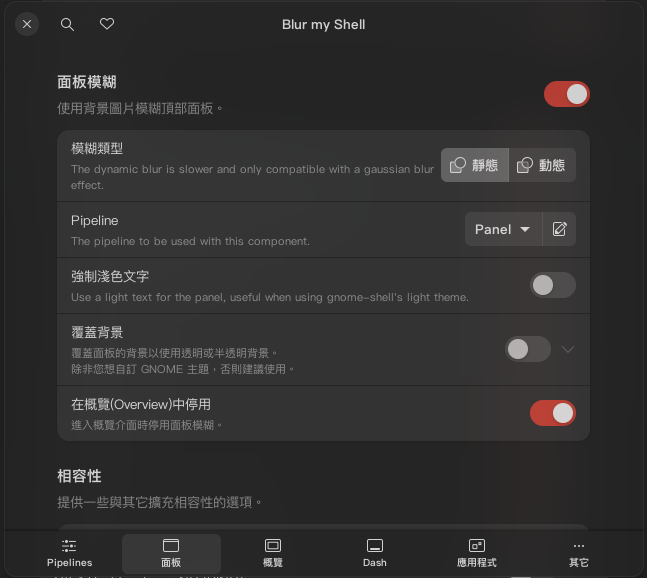

# 動態頂部面板
靈感來源於KDE Plasma6 的懸浮面板的設計，在附近沒有窗口時呈現半透明懸浮條效果，而當窗口靠近時則呈現實色面板的樣式。支援gnome的暗色模式和亮色模式切換。

## 懸浮模式

當topbar附近沒有窗口時，會呈現懸浮模式，懸浮模式僅僅有半透明效果，沒有模糊效果（*正在嘗試內建模糊效果*），目前如果想要模糊效果，建議搭配Blur my shell對於面板的靜態pipeline使用。Blur my shell動態模式會沒有圓角，這是Blur my shell的問題。
### Blur my shell 設定

使用靜態效果，因為動態效果不支援圓角

記得在對應的Pipeline中添加「角落(Corner)」效果，並設定半徑到最大（數值超出並不會有影響，最多就是完全變成膠囊）
### 搭配Blur my shell使用的效果

## 停靠模式/實體模式

當有任何窗口足夠靠近（幾乎接觸）Topbar時，Topbar將會變為gnome默認的不透明的停靠欄，與最大化窗口可以更好的融合，而不像主題一樣始終懸浮會有「漏光」的現象。

# 安裝擴展
### 1. 從Gnome Extensions安裝
擴展鏈接：[https://extensions.gnome.org/extension/7284/dynamic-panel/](https://extensions.gnome.org/extension/7284/dynamic-panel/)
### 2. 從GitHub安裝
從GitHub Clone或下載Zip到本地，解壓縮所有文件到`~/.local/share/gnome-shell/extensions/dynamic-panel@velhlkj.com/`目錄不存在則自行創建即可。注意不要套娃！extension.js應該直接在`dynamic-panel@velhlkj.com`中，而不是在`dynamic-panel@velhlkj.com/dynamic-panel/`中。

目錄是固定的，包括`dynamic-panel@velhlkj.com`也是，**不可以更改目錄名**，否則擴展將不會顯示在列表中，也無法生效。這是由於gnome擴展要求目錄名與metadata.json中指定的uuid保持一致的原因。

# 關於性能
由於gnome自身的css和gjs的緣故，CSS3的transition補間動畫居然對大部分屬性都是無效的！而requestAnimationFrame這個動畫幀對齊函數也無法使用。因此不得不使用固定幀間隔的循環做逐幀動畫來實現平滑移動、大小改變和圓角動畫，因此在**動畫過程中**性能上會有一定影響。但在**靜止狀態下不存在性能影響**。

# 特別鳴謝
**感謝transparent-top-bar的思路，因為剛剛接觸gjs，所以窗口靠近判定的實現靈感基本來源於transparent-top-bar的源碼。沒有這個代碼的思路作為參考，此擴展將難以實現**

**感謝Google Gemini在研究過程中提供的幫助**
